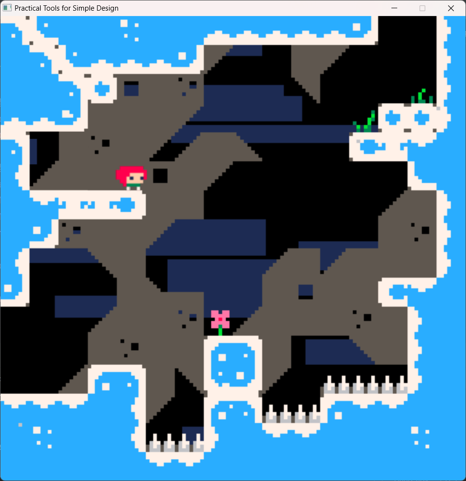
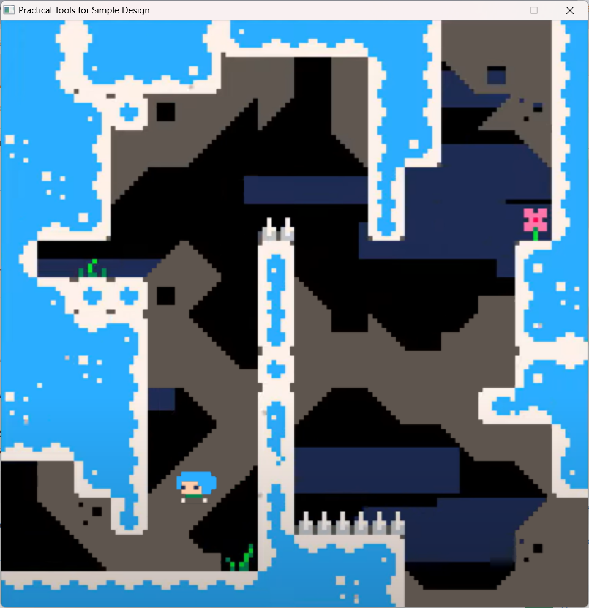
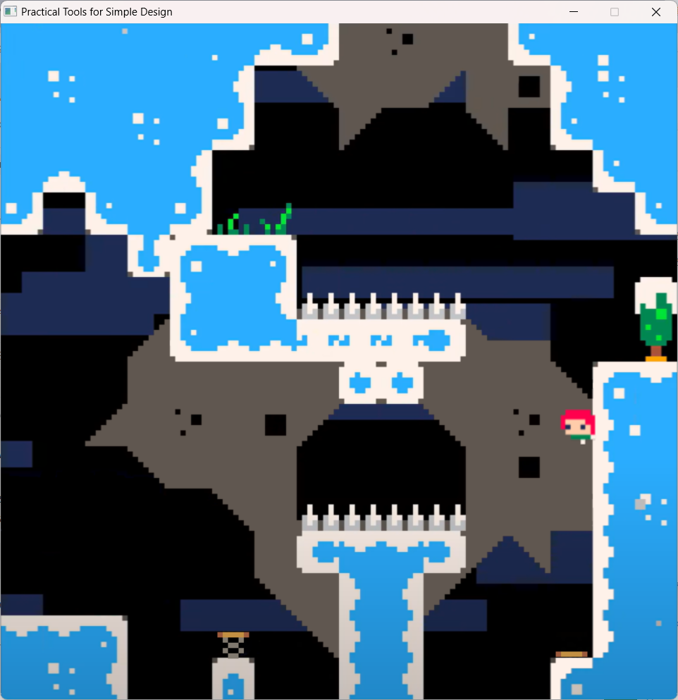
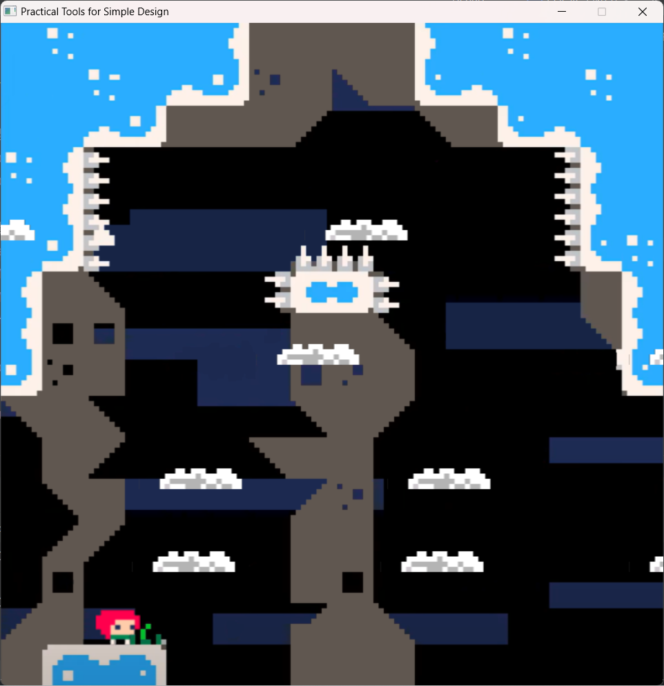
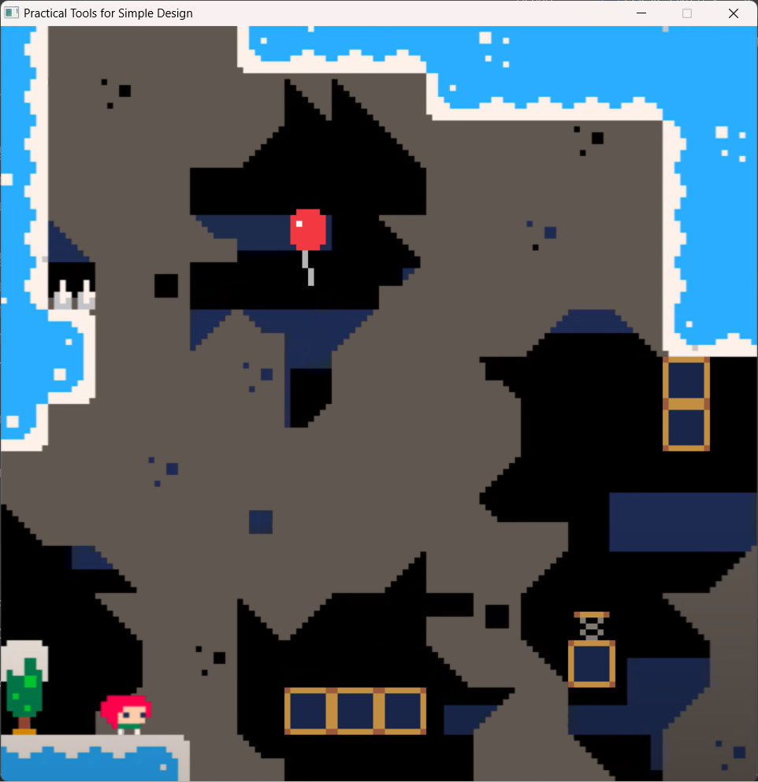
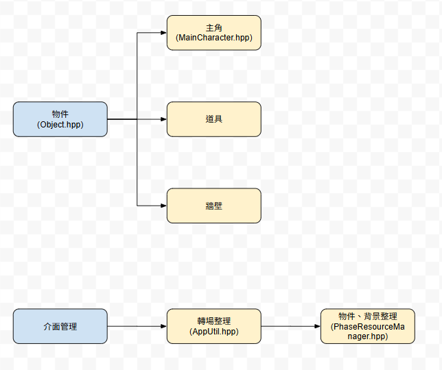

# 2025 OOPL Final Report

## 組別資訊

組別：P22-1
組員：詹東儒
復刻遊戲：Celeste-Piko8

## 專案簡介

### 遊戲簡介

Celeste是一款2D縱向卷軸像素跑酷遊戲，我做的版本是作者在網站上發行的原型版(prototype)。會選這款遊戲當專案是因為我喜歡挑戰有難度的遊戲，這讓我在通關時很有成就感，有種花了好幾小時終於克服困難的快樂，但這款遊戲的特別之處在於它只需要簡單易懂的操作機制以及優秀的操作手感，就能創造出獨特複雜的關卡設計之餘，又能讓玩家相信自己辦得到，讓我花3~4個小時黏在電腦螢幕前玩這款小遊戲。

遊戲裡總共有30關，每10關會有一層休息區，這次實習總共復刻了10關，由於原型版並沒有劇情，所以實作遊戲上也沒有劇情需求。

### 組別分工

此專案中，除了地圖與道具(不包含人物)的圖片製作以及跳躍緩衝是由前組員——林希芸製作，其餘皆是我獨自完成

## 遊戲介紹

### 遊戲規則

此遊戲只需操控一個主角，主角會在更換場景時重設重生點，爬到指定關卡即可通關，角色使用上下左右鍵移動，C 鍵跳躍，X 鍵衝刺(需配合方向鍵設定方向，共八個方位)，若有牆壁則角色可以無數次蹬牆跳，但只能衝刺一次，每次落地或觸碰氣球即可重製衝刺機會，碰到尖刺陷阱或掉出地圖外會回到重生點，碰到指定的上層缺口則切換到下一關，玩家的任務就是操控主角設法向上爬到目的地，其中會運用到彈簧、木箱、氣球、雲朵，原本遊戲還有草莓解成就用，但是我並未做出。

Debug 模式：按下 U 鍵會重新生成地圖，debug log會顯示「正常模式：0」，此時掉入尖刺或掉出地圖外不會使角色死亡，再按一次地圖會重新刷新，即可恢復正常模式：1；按下 I 鍵角色會開啟無限衝刺，debug log顯示「無限衝刺：1」，再按一次即可恢復。(Debug按鍵每次按需隔3秒才能再觸發一次)

### 遊戲畫面

## 程式設計

### 程式架構

我的程式主要分為兩大類：一是角色與道具，二是背景切換與遊戲核心。角色、道具皆是繼承Object.hpp後衍生的物件，而背景切換、遊戲核心主要是圍繞App.h實作介面。

### 程式技術

在這次實習課我所學到的技術中，令我印象最深刻的應該是寫一個類別將所有需互動的物件從寫好的txt檔讀取並用智慧指標管理，並在更新的時候清空地圖中所有舊物件，並宣告新的，使整張地圖中需偵測、互動的物件(包括隱形牆)維持在200個以內，然後再寫一個物件去管理這個物件及轉場。第二件事是參考了很多不同的重力系統寫法，以及碰撞箱的判定，雖然我選了一種相對麻煩的寫法，但也因此能觀察到各種寫法帶來的不同效果。我的寫法容易因一個數值改動就牽一髮而動全身，但是也能做出很精準的調整，因為如果把各個數值分開來寫會很難有微妙的變化。第三點比較偏向遊戲性，在實作這款遊戲前，我並未想過「要怎麼做才能讓玩家手感回饋更好」這件事，經過這次實作前的詳細調查，發現此遊戲為了呈現出優秀的手感回饋，在很多細節部分下了功夫，就如同上述的重力系統，還有郊狼時間、跳躍緩衝等。

## 結語

### 問題與解決方法

在實驗過程中有遇到很多困難，尤其是主角的移動，我已經重構它的程式有三次了，每一次都是一小部分的重構，在這期間還會時不時地調整參數，印象第二深的困難在雲朵的位移需連接角色，但是當初寫好時，角色的位移量是雲朵的一半，怎麼改都沒有用，直到後面與其他組別的同學討論後，找到了根本上的問題才解決，此問題也與主角的碰撞判定有關。雖然解決了絕大部分的問題，但還是有一點點的bug找不出解法，像是主角會剛好插入雲朵物件中，而不是一定要在雲朵上，但是主角還能移動，還有當主角透過雲朵位移到牆邊會騰空，我大概知道是哪裡出問題，但也沒辦法再改了，算是小小的遺珠。最後有個小小的遺憾，就是沒辦法做出頭髮的骨架，做不出頭髮的飄動感，只能把主角做成短髮。

### 自評

| 項次 | 項目                   | 完成 |
|------|------------------------|-------|
| 1    | 完成與教學團隊協議的最小關卡數 |  V  |
| 2    | 完成專案權限改為 public |  V  |
| 3    | 具有 debug mode 的功能  |  V  |
| 4    | 解決專案上所有 Memory Leak 的問題  |  V  |
| 5    | 報告中沒有任何錯字，以及沒有任何一項遺漏  |  V  |
| 6    | 報告至少保持基本的美感，人類可讀  |  V  |

### 心得

經歷一番波折後，終於把遊戲做完了，尤其是絕大部分是我獨自做完的，頓時覺得很有成就感。雖然與助教討論的最終結果是做10關，但是做到後面發現其實做完道具後，關卡目標幾關都不重要了，因為只要截圖做地圖、寫地圖矩陣txt檔就可以量產關卡，但是在這最後的兩個禮拜我選擇將時間花在精修程式以及debug上，重質不重量，把遊戲做的更好一點。

### 貢獻比例

詹東儒(我)--100%
